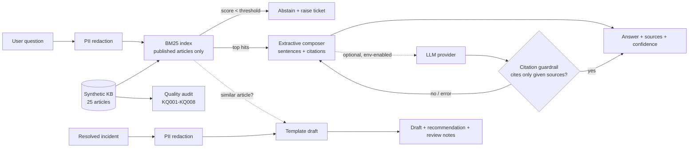

# KB GenAI Assist Demo

> **Disclaimer:** Representative portfolio project built with synthetic data. Not derived from any employer or client code.

A knowledge-management assistant modelled on the GenAI use cases now common in ITSM platforms (for example Now Assist-style knowledge features). It runs on a synthetic set of 25 IT and banking-operations knowledge articles:

1. **Answers questions with citations.** BM25 retrieval plus extractive answer composition. It runs fully offline and needs no API key.
2. **Drafts knowledge articles from resolved incidents**, using templates and PII redaction, and checks for an existing article first.
3. **Audits knowledge quality**: expired or stale content, missing metadata, thin articles, near-duplicates, low helpfulness, links to retired articles.
4. Offers an **optional LLM provider hook**. It is disabled by default and configured only through environment variables. A citation guardrail rejects ungrounded output.

## Business use case

Service desks in banks and insurers depend on knowledge to resolve issues quickly and consistently. GenAI can help, but in a regulated environment it has to be:

- **grounded**, so every statement traces back to an approved article, and when no article covers the question the assistant says so instead of guessing;
- **privacy-safe**, so account numbers, card numbers and contact details never leave the boundary in prompts;
- **governed**, so stale or duplicate articles are found and fixed, because they cause wrong answers whether or not AI is involved.

This demo shows those controls working end to end, with no external service needed.

## What it demonstrates

| Capability | Implementation |
|---|---|
| Retrieval | BM25 written from scratch, with field weighting (title x3, tags x2, body x1), a light stemmer and stopwords. Only **published** articles are indexed; drafts and retired content can never appear in answers. |
| Grounded answers | Extractive: picks the best sentences from the top 1 or 2 articles, giving priority to resolution steps, and tags each with `[n]`. Confidence (high/medium/low) comes from the score and the margin over the next result. **Abstains** below a score threshold and suggests raising a ticket. |
| PII redaction | Email, card, national id, phone and account-number patterns are removed from questions before processing and from incident text before drafting. |
| Optional LLM | `LLMProvider` protocol plus an HTTPS "chat completions" provider. Disabled unless `KB_ASSIST_LLM_ENABLED=true`. The key is read from the environment and never shown in `repr` or logs. Output is accepted **only** if it cites the supplied sources and nothing else; otherwise, and on any provider error, the extractive answer is used. |
| Incident to KB draft | Template-based (Symptoms / Applies to / Cause / Resolution or Workaround). Recommends *update existing* when a similar article exists, *not suitable* for non-reusable resolution codes, and lists review notes such as missing cause or too few steps. |
| KB quality audit | KQ001 expired but published · KQ002 review overdue · KQ003 missing metadata · KQ004 thin content · KQ005 no resolution section · KQ006 near-duplicate (TF-IDF cosine) · KQ007 low helpfulness · KQ008 links to retired articles. |

## Architecture



## Tech stack

Python 3.10+ (standard library only) · pytest · ruff · Docker · GitHub Actions

## Setup

```bash
git clone https://github.com/abdulraheemm064/kb-genai-assist-demo.git
cd kb-genai-assist-demo
python -m venv .venv && source .venv/bin/activate
pip install -r requirements-dev.txt
```

## Usage

```bash
python -m kb_assist ask "VPN keeps failing with error 809 when I work from home"
python -m kb_assist ask "renew tls certificate" --json
python -m kb_assist draft --incident INC0091001 --as-of 2026-10-01
python -m kb_assist audit --as-of 2026-10-01           # add --json for machine-readable output
python -m kb_assist demo --out docs/sample-output.md   # regenerates the sample document

# Docker
docker build -t kb-assist .
docker run --rm kb-assist ask "teller receipt printer not printing"
```

Exit codes for `ask`: `0` answered, `3` abstained, `1` configuration or input error.

### Optional LLM provider (off by default)

```bash
cp .env.example .env     # fill in values from your organisation's secret store; never commit .env
set -a && source .env && set +a
python -m kb_assist ask "card authorization is timing out"
```

Point it only at an AI gateway your organisation has approved for this data classification. Questions are redacted before they are sent, but article content is sent as context.

## Sample output

Full output is in [`docs/sample-output.md`](docs/sample-output.md). An extract:

```text
### Q: card authorization is timing out, what should I do first?
- Raise a P1 major incident immediately; card authorization is a critical service. [1]
- Check the Card Authorization service map for red CIs and open alerts from the last 15 minutes. [1]
- If the load balancer pool shows members down, fail traffic over to the secondary data centre ... [1]
...
Sources:
  [1] KB0010004 - Card authorization timeouts - first response runbook
(confidence: high, mode: extractive)

### Q: what is the capital of France?
I could not find a knowledge article that answers this. Please raise a ticket with the service desk so an analyst can help.
(confidence: none, mode: abstained)
```

Audit summary on the synthetic KB (as of 2026-10-01): 24 active articles, 5 with issues (79.2% healthy). Issues found: 2 expired, 3 overdue for review, 2 missing metadata, 1 thin, 1 near-duplicate, 2 with low helpfulness, and 1 link to a retired article.

The sample output also shows two weaknesses, left in on purpose:

- **The near-duplicate wins.** For the VPN question, the thin duplicate KB0010003 outranks the fuller KB0010002. The audit flags it as KQ006 with "merge into KB0010002", which shows why content governance matters for AI answers.
- **Lexical retrieval can pick the wrong article.** A question about a *customer's* online banking lockout retrieves the *staff* Active Directory unlock article, because the two share the words "account" and "locked". Semantic retrieval or audience metadata would fix this (see future enhancements).

## Tests

```bash
pytest       # 44 tests, no network, no API key
ruff check .
```

The tests cover the tokenizer and stemmer; top-hit relevance for six questions; exclusion of unpublished articles; title boosting; citation format; extractive answers containing only text found in the source articles; abstention; query redaction; the citation guardrail; the LLM hook (disabled by default, HTTPS and key required, key hidden from `repr`, prompt redacted, fallback on ungrounded output or provider error, no call when abstaining); every PII kind plus no false positives on operational text; draft structure, redaction, similar-article and workaround handling, review notes and required fields; every audit rule with exact counts; and the CLI.

## Security considerations

- **No secrets in the repository.** The LLM key comes only from the environment (`.env.example` has placeholders, and `.env` is git-ignored). The provider refuses non-HTTPS endpoints.
- **Data minimisation.** Questions and incident notes are redacted with pattern rules before use. Pattern redaction lowers risk but is not complete, so treat it as one control among several.
- **Grounding.** The LLM's output is discarded unless it cites only the supplied sources, and the extractive answer is always available as a fallback.
- **Content safety.** Retired and draft articles are never searchable. The audit flags articles that link to retired procedures.
- **Sensitive procedures.** The synthetic articles model good practice: identity verification, never sending recovery keys or passwords by email, and approval for stand-in or threshold changes.

## Limitations and future enhancements

- Lexical BM25 misses synonyms ("sign-in" and "login"), as the lockout example shows. Next steps: hybrid retrieval with embeddings, plus audience and role metadata (staff or customer) as filters.
- Extractive answers can read as choppy. That is the trade-off for being provably grounded.
- The near-duplicate check is pairwise O(n^2). Large knowledge bases need MinHash or embedding clustering.
- Drafting is template-based. An approved LLM could improve the wording, still behind the same review workflow.
- Ideas for later: knowledge feedback loops (deflection rate, "was this helpful"), multilingual articles, and a ServiceNow Table API loader for `kb_knowledge` with read-only OAuth.

## Licence

MIT. See [LICENSE](LICENSE).

---

Representative portfolio project built with synthetic data. Not derived from any employer or client code. "Now Assist" is mentioned only to describe the category of use case. This project is not affiliated with or endorsed by ServiceNow.
